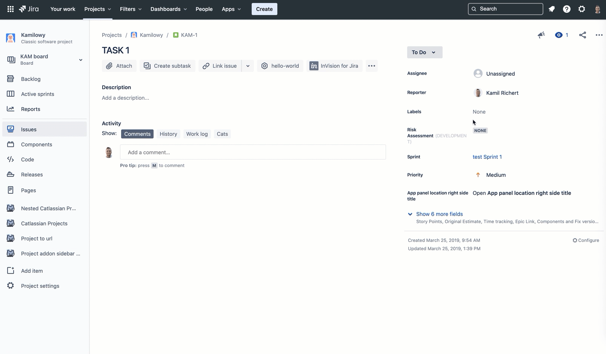

# Risk Assessment Custom Field

 

This simple Forge app adds a risk assessment custom field that you can configure on your issue screens in classic projects.
The purpose of the app is to demonstrate how to use the [Jira custom field Forge extension point](https://developer.atlassian.com/platform/forge/manifest-reference/#jira-custom-field) with custom editing experience. 

## Usage

* Go the the list of custom fields.
* Find the *Risk assessment* custom field.
* Click the *more* menu, and then select *Associate to Screens*.
* Check the screens you want to use the field on, and then click *Update*.

## Installation

If this is your first time using Forge, the [getting started](https://developer.atlassian.com/platform/forge/set-up-forge/) 
guide will help you install the prerequisites.

If you already have a Forge environment setup, you can deploy this example right away.
See [example apps](https://developer.atlassian.com/platform/forge/example-apps/) for installation steps.

## Documentation

The app consists of one custom field defined in the `manifest.yml` file. 
The custom field's view is implemented by the `renderFieldView` function defined in `/src/index.jsx`. 
The custom field’s editing experience is implemented by the `renderFieldEdit` function defined in `/src/index.jsx`. 

## Contributions

Contributions to Forge Risk Assessment Custom Field are welcome! Please see [CONTRIBUTING.md](CONTRIBUTING.md) for details. 

## License

Copyright (c) 2020 Atlassian and others.
Apache 2.0 licensed, see [LICENSE](LICENSE) file.